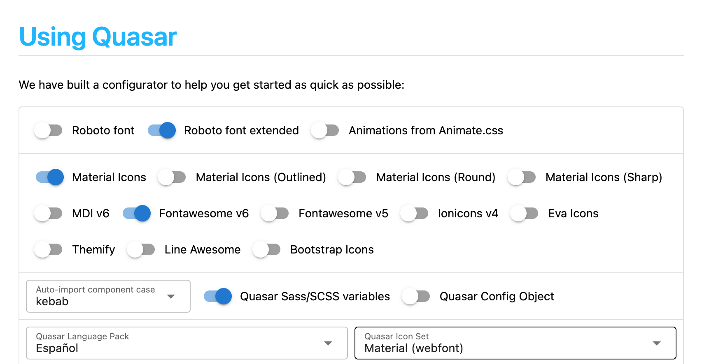

# Quasar + Vite + Pinia (vue 3)
 
Esto es una repositorio de pruebas para usar Quasar Framework, en su versión 2.66 (para vue 3), usando Vite Plugin y Pinia como almacen de datos.

# Inicio del proyecto

Para iniciar el proyecto Quasar con Vite Plugin he realizado las siguientes operaciones, el detalle está en la web https://quasar.dev/start/vite-plugin :

```sh
$ npm init vite@latest my-vue-app -- --template vue
$ npm install quasar @quasar/extras
$ npm install -D @quasar/vite-plugin sass@1.32.0
```

En las opciones, he seleccionado las siguientes:



El main.js lo he sustituido por:

```js
import { createApp } from 'vue'
import { Quasar } from 'quasar'
import quasarLang from 'quasar/lang/es'

// Import icon libraries
import '@quasar/extras/roboto-font-latin-ext/roboto-font-latin-ext.css'
import '@quasar/extras/material-icons/material-icons.css'
import '@quasar/extras/fontawesome-v6/fontawesome-v6.css'

// Import Quasar css
import 'quasar/src/css/index.sass'

// Assumes your root component is App.vue
// and placed in same folder as main.js
import App from './App.vue'

const myApp = createApp(App)

myApp.use(Quasar, {
  plugins: {}, // import Quasar plugins and add here
  lang: quasarLang,
})

// Assumes you have a <div id="app"></div> in your index.html
myApp.mount('#app')
```

Y el `vite.config.js` por:

```js
import { defineConfig } from 'vite'
import vue from '@vitejs/plugin-vue'
import { quasar, transformAssetUrls } from '@quasar/vite-plugin'

// https://vitejs.dev/config/
export default defineConfig({
  plugins: [
    vue({
      template: { transformAssetUrls }
    }),

    quasar({
      sassVariables: 'src/quasar-variables.sass'
    })
  ]
})
```

Luego he creado el `src/quasar-variables.sass` y le he puesto como contenido:

```sass
$primary   : #1976D2
$secondary : #26A69A
$accent    : #9C27B0

$dark      : #1D1D1D

$positive  : #21BA45
$negative  : #C10015
$info      : #31CCEC
$warning   : #F2C037
```

Para finalizar con el proceso de inicialización he instalado Pinia, en su versión 2.0.13:

```sh
$ npm install pinia
```